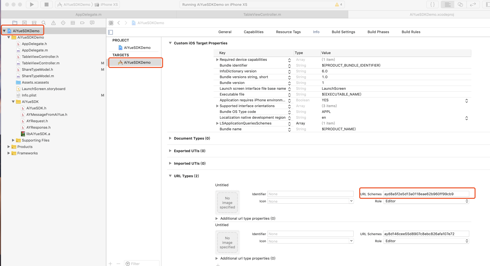

# 爱约SDK iOS版接入文档
>在接入AiYueSDK之前需要：
>1. 申请AppID
>2. 获取AiYueSDK、
>3. 安装爱约app
>下载地址(务必在手机上打开)：http://45666.com/m/index.html


#### 一、注册AppID与叫起app
在使用SDK时需要把SDK添加到你的工程中，并使用SDK的地方导入头文件`#import "AiYueSDK.h"`;
如果需要在分享链接中传递自定义数据还需要实现`AiYueSDKDelegate`协议、设置SDK的代理，具体参见AiYueSDKDemo
##### 注册AppID
在使用AiYueSDK之前需要先注册AppID。具体在AppDelegate中app启动方法中注册AppID。
```Objective-C
- (BOOL)application:(UIApplication *)application didFinishLaunchingWithOptions:(NSDictionary *)launchOptions {

    // ...
    // 注册AppID
    [[AiYueSDK defaultService] registerWithAppID:@"yourAppID"];
    // ...
    return YES;
}
```

##### 叫起app
当爱约处理完app的请求后(比如，授权登录、分享链接到爱约)，会再需要的时候叫起你的app；
当用户点击你分享到爱约的链接时，如果用户手机上安装了你的app，也会叫起你的app；
这时需要在以下方法中处理叫起之后的任务。
```Objective-C
-(BOOL)application:(UIApplication *)application openURL:(NSURL *)url sourceApplication:(NSString *)sourceApplication annotation:(id)annotation
{
    // ...
    // 处理爱约叫起你的app
    [[AiYueSDK defaultService] handleOpenURL:url];
    // ...
    return YES;
}
```
**注意**： 如果程序中存在不止一个处理叫起app的方法，需要把上述代码在每个方法中都写一遍。

另外，为了让爱约能叫起你的app，需要为你的app添加一个新的URL Schemes，URL Schemes值就是你的AppID；
示例如下：



#### 二、功能
AiYueSDK支持授权登录、分享图片、链接等功能；
##### 1、授权登录
使用爱约的授权登录功能，你的app可以获取爱约用户的基本信息，包括：头像、昵称和性别。
获取爱约用户的基本信息分为两步：获取openId和通过AppID、openId获取用户基本信息
###### 获取openId
示例代码如下
```Objective-C
/* 授权登录 */
// 1. 创建一个授权登录请求
AYAuthorizeLoginRequest *request = [AYAuthorizeLoginRequest new];
// 2. 发送授权登录请求
[[AiYueSDK defaultService] sendRequest:request completion:^(AYResponse *response) {
// 3.在这里处理授权结果
    if (AYErrorTypeNone == response.errorType)
    {// 授权成功
        NSLog(@"授权成功");
        if ([response isKindOfClass:[AuthorizeLoginResponse class]])
        {
            // 4.获取openId
            NSString *openId = [(AuthorizeLoginResponse *)response openId];
            NSLog(@"openId: %@", openId);
             // 5.获取爱约用户基本信息
            [self requestUserInfoWithAppId:AiYueAppId OpenId:openId];
        }

    } else if (AYErrorTypeUserCancell == response.errorType)
    {
        // 用户取消了授权
        NSLog(@"用户取消了授权");
    } else
    {
        // 授权失败
        NSLog(@"授权失败");
    }
}];
```
###### 通过AppID、openId获取用户基本信息
示例代码如下，其中接口说明详见AiYueSDKDemo中如下方法的函数体
```Objective-C
 /*
去爱约服务器获取爱约用户基本信息；
HTTP请求方式：GET/POST
*/
- (void)requestUserInfoWithAppId:(const NSString *)appId OpenId:(const NSString *)openId
{
    NSString *urlStr = [NSString stringWithFormat:@"http://120.76.156.189/wl/index.php/app/api/getKeyUserInfo?key=%@&uid=%@", appId, openId];
    NSURL *url = [NSURL URLWithString:urlStr];
    NSURLRequest *request = [NSURLRequest requestWithURL:url];
    NSURLSessionDataTask *task = [[NSURLSession sharedSession] dataTaskWithRequest:request completionHandler:^(NSData * _Nullable data, NSURLResponse * _Nullable response, NSError * _Nullable error) {
        if (nil == error)
        {// 网络请求成功

            // 提取json数据
            NSDictionary *dataInfo = [NSJSONSerialization JSONObjectWithData:data options:NSJSONReadingMutableContainers error:nil];
            // 获取状态码
            int code = [dataInfo[@"code"] intValue];
            NSString *msg = dataInfo[@"msg"];
            NSLog(@"code[%d]: %@", code, msg);
            if (1 == code)
            { // 获取用户信息成功

                // 获取爱约用户昵称
                NSString *nickname = dataInfo[@"nickname"];
                // 获取爱约用户头像
                NSString *headsmall = dataInfo[@"headsmall"];

                // 获取爱约用户性别： 0 未知， 1 男， 2 女
                int gender = [dataInfo[@"gender"] intValue];
                NSLog(@"\n爱约用户基本信息:\n昵称：%@\n头像：%@\n性别：%d\n", nickname, headsmall, gender);

            } else if (400 == code)
            {// 非法请求
                /* 可能是appId不对 */
            } else if (401 == code)
            {// 用户不存在

            }

        } else
        {// 网络请求失败
            NSLog(@"error: %@", error);
        }
    }];

    [task resume];
}
```
##### 2、分享图片
分享UIImage类型的图片到爱约。
示例代码如下：
```Objective-C
/* 分享图片 */

// 1. 创建一个分享图片的请求
AYShareImageRequest *request = [AYShareImageRequest new];
// 分享的图片必须是UIImage类的对象
request.image = [UIImage imageNamed:@"feature1_"];
// 2. 发送该请求
[[AiYueSDK defaultService] sendRequest:request completion:^(AYResponse *response) {
// 3. 在这里处理分享图片结果
    if (AYErrorTypeNone == response.errorType)
    {// 分享图片成功
        NSLog(@"分享图片成功");

    } else if (AYErrorTypeUserCancell == response.errorType)
    {// 用户取消了分享图片
        NSLog(@"用户取消了分享图片");
    } else
    {// 分享图片失败
        NSLog(@"分享图片失败");
    }
}];
```
##### 3、分享链接
分享链接到爱约。
链接有五个属性：
- 标题
- 内容
- 缩略图
图片url
- 链接地址
- 扩展
字典类型的属性，选填；

用户在爱约中点击分享的链接时，如果用户手机没有安装了您的app，爱约会打开该链接；
如果安装了您的app，爱约会叫起您的app并把扩展数据传递给您的app，如果存在扩展的话；
示例代码如下：
```Objective-C
/* 分享带扩展链接 */

 // 1. 创建一个分享带扩展链接的请求
AYShareLinkRequest * request = [AYShareLinkRequest new];
request.linkAdress = @"http://www.45666.com/";
// 该属性只能传NSString类型的网址
request.thumbnailImage = @"http://imagecdn.663550.com/image/user/avatar/2018/12/21/e34d81aac656af7b492f72f25dba5bf4.jpg";
request.title = @"房间开好了，就等你了！";
request.content = @"超好玩，房间开好了，就等你了。快！速度上车！！";
request.ext = @{
                KInviterId : @"someone",
                KInviterName : @"9527",
                KGameRoomId  : @1001,
                };

// 2. 发送该请求
[[AiYueSDK defaultService] sendRequest:request completion:^(AYResponse *response) {
// 3. 在这里处理分享带扩展链接的结果
    if (AYErrorTypeNone == response.errorType)
    {// 分享带扩展链接成功
        NSLog(@"分享带扩展链接成功");
    } else if (AYErrorTypeUserCancell == response.errorType)
    {// 用户取消了分享带扩展链接
        NSLog(@"用户取消了分享带扩展链接");
    } else
    {// 分享带扩展链接失败
        NSLog(@"分享带扩展链接失败");
    }
}];
```

#### 三、接收自定义数据
通过分享扩展链接，你可以把自定义数据传递给爱约。当用户点击扩展链接时，爱约在叫起你的app时
会把自定义数据传给你的app。获取传递的自定义数据，需要实现`AiYueSDKDelegate`协议。
示例代码如下：
```Objective-C
// 定义AppDelegate遵守AiYueSDKDelegate协议
@interface AppDelegate () <AiYueSDKDelegate>

@end

@implementation AppDelegate

// ...

- (BOOL)application:(UIApplication *)application didFinishLaunchingWithOptions:(NSDictionary *)launchOptions {

    // ...
    // 设置AiYueSDK的代理
    [AiYueSDK defaultService].delegate = self;
    // ...
    return YES;
}

// 实现AiYueSDKDelegate协议
- (void)AiYueSDK:(AiYueSDK *)sdk didReceiveMessage:(AYMessageFromAiYue *)message
{
    NSDictionary *info = message.info;
    if (info)
    {// 有扩展信息
        NSString *inviterId = info[KInviterId];
        NSString *nviterName = info[KInviterName];
        int gameRoomId  = [info[KGameRoomId] intValue];

        NSLog(@"通过分享链接传递的扩展信息:\n inviterId: %@\n nviterName: %@\n gameRoomID: %d\n", inviterId, nviterName, gameRoomId);
    } else
    {// 没有扩展信息

    }
}
// ...
```

#### 四、检测爱约是否已安装
有时候需要判断用户手机上是否安装了爱约，此时可以使用一下方法
```Objective-C
BOOL isInstalled = [AiYueSDK isAiYueInstalled];
```
**注意** 需要在“Info.plist”中将爱约的URL Schemes——`aiyuesdk`列为白名单，才可正常检测爱约是否安装。
